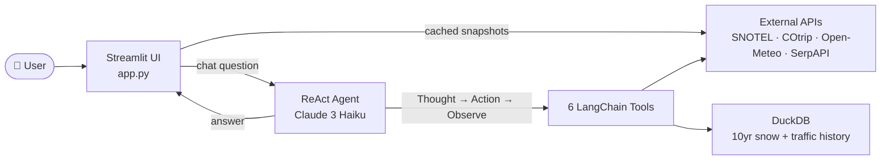
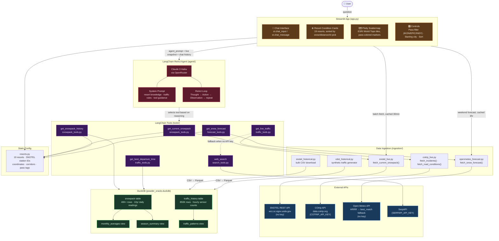

# Colorado Powder Oracle — Architecture

## Simple Overview

---

## Detailed Architecture

## Data Flow Summary

| Path | Flow | Latency |
|------|------|---------|
| **Live snow** | User → UI (cached) → `snotel_live.py` → SNOTEL API | ~2s (batch, cached 30min) |
| **Historical snow** | User → Agent → `get_snowpack_history` → DuckDB | ~50ms |
| **Live traffic** | User → Agent → `get_live_traffic` → COtrip API | ~1s |
| **Historical traffic** | User → Agent → `get_best_departure_time` → DuckDB | ~50ms |
| **Forecast** | User → UI (cached) → `openmeteo_forecast.py` → Open-Meteo API | ~1s (cached 3hr) |
| **Web search** | User → Agent → `web_search` → SerpAPI | ~2s |

## Key Design Decisions

1. **DuckDB over traditional DB** — Columnar storage matches our analytical workload (aggregations across many rows, few columns). No server infrastructure needed.
2. **ReAct agent** — LLM reasons step-by-step, selecting tools based on the question. Handles multi-part questions (snow + traffic) in a single conversation turn.
3. **Dual data paths** — UI fetches live conditions directly (cached, fast page load). Agent queries the same APIs on-demand for conversational questions.
4. **Graceful degradation** — Every tool returns an actionable message on failure, never raises exceptions. Missing API keys trigger fallback to `web_search`.
